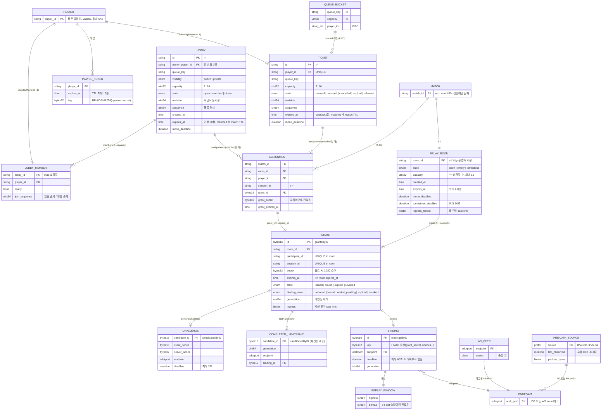
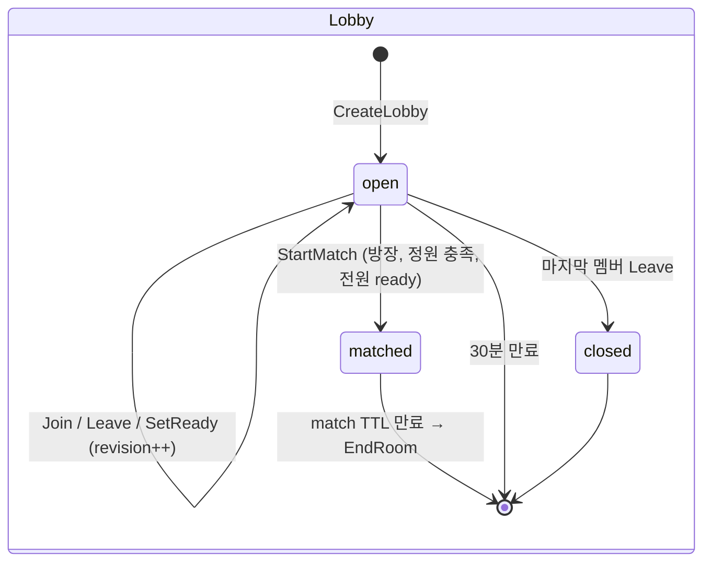
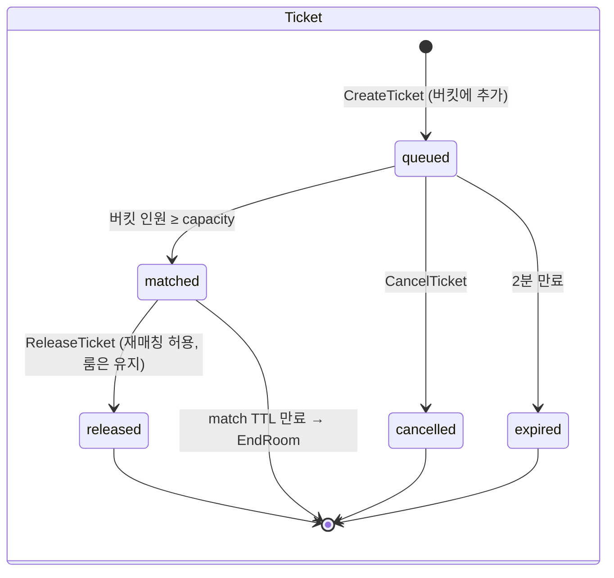
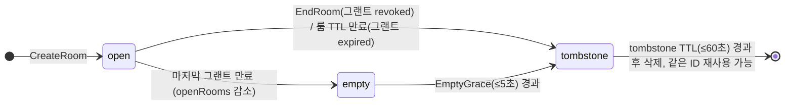
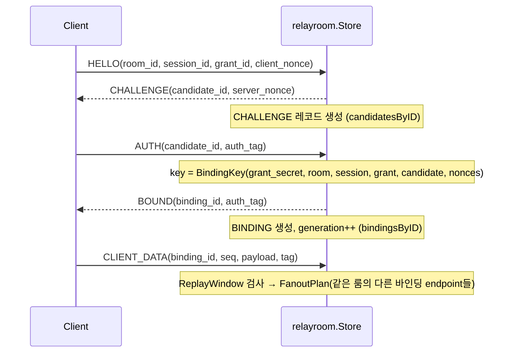

# ERD — go-lobby-relay 도메인 데이터 모델

> 기준: `claude/epic-cori-1uzcid` 브랜치의 현재 구현 (`internal/matchmaking`, `internal/relayroom`, `internal/playerauth`, `internal/udprelay`, `internal/wsrelay`)

## 0. 전제

- **영속 DB가 없습니다.** 모든 상태는 프로세스 메모리에 있으며 재시작하면 사라집니다. 이 문서의 "엔티티"는 테이블이 아니라 Go 구조체(`*Record`)이고, "PK/FK"는 `map` 키와 ID 필드 참조를 뜻합니다.
- 상태는 두 개의 저장소에 나뉘어 있습니다.
  - **`matchmaking.Manager`** (단일 `sync.Mutex`): 로비, 로비 멤버, Quick Match 티켓, 큐, 매치 ID
  - **`relayroom.Store`** (단일 `sync.RWMutex`): Relay 룸, 그랜트(참가자 세션), 핸드셰이크, 바인딩, 사전 인증 소스
- Manager는 Store를 **단방향으로** 호출합니다(`CreateRoom`, `EndRoom`). Store는 Manager를 모릅니다.
- 만료는 벽시계(`expiresAt`, API 응답용)와 단조 시계(`monoDeadline`, 실제 판정용) 두 값으로 관리합니다.

## 1. 전체 ERD

## 2. 영역별 설명

### 2.1 플레이어 인증 (`internal/playerauth`)

| 항목 | 내용 |
|---|---|
| 저장 여부 | **저장하지 않음** (stateless 토큰) |
| 형식 | `version(1) ‖ expires(8) ‖ len(1) ‖ player_id ‖ HMAC-SHA256` → base64url |
| 발급 | 운영자 API `POST /v1/player-tokens` |
| 사용 | 플레이어 API `Authorization: Bearer <token>` → `Claims.PlayerID` |

`player_id`는 서버 어디에도 "플레이어 테이블"로 존재하지 않고, 토큰에서 꺼낸 문자열이 로비/티켓의 외래 키 역할만 합니다.

### 2.2 로비 & Quick Match (`internal/matchmaking`)

**Manager 인덱스**

| 맵 | 키 → 값 | 의미 |
|---|---|---|
| `lobbiesByID` | lobby_id → `*lobbyRecord` | 로비 본체 (최대 256개) |
| `lobbyByPlayer` | player_id → lobby_id | 플레이어당 로비 **최대 1개** |
| `ticketsByPlayer` | player_id → `*ticketRecord` | 플레이어당 티켓 **최대 1개** (전체 최대 4096개) |
| `queues` | (queue_key, capacity) → []player_id | 매칭 대기열 버킷 |
| `matchIDs` | match_id → ∅ | 살아있는 매치 ID 집합 (중복 방지) |
| `nextSequence` | — | 로비/티켓/입장 순서용 전역 단조 증가 값 |

**제약 조건**

- **로비 ↔ 티켓 상호 배타**: `CreateLobby`, `JoinLobby`, `CreateTicket` 모두 `lobbyByPlayer`와 `ticketsByPlayer`를 함께 검사해 `ErrConflict`를 반환합니다. 한 플레이어는 동시에 로비 멤버이거나 티켓 보유자 중 하나만 될 수 있습니다.
- **낙관적 동시성**: 로비/티켓의 모든 변경 요청은 `revision`을 받아 현재 값과 다르면 `ErrConflict`입니다.
- **방장 불변식**: `owner_player_id`는 항상 `members` 중 하나. 방장이 나가면 `join_sequence`가 가장 작은 멤버가 승계하고, 마지막 멤버가 나가면 로비는 `closed`로 삭제됩니다.
- **Ready 초기화**: 멤버 입장/퇴장 시 전원의 `ready`가 `false`로 리셋됩니다.
- **목록 노출**: `ListLobbies`는 `open` + `public` + 같은 `queue_key`만, `sequence` 기반 커서로 페이지(최대 50)합니다. `private`/`matched` 로비는 멤버에게만 `GetLobby`로 보입니다.

**상태 전이**

`cancelled`/`released` 스냅샷은 응답으로만 반환되고, 레코드는 즉시 `ticketsByPlayer`에서 삭제됩니다.

### 2.3 매치와 Assignment

`Match`는 독립 레코드가 없고 `matchIDs` 집합의 ID로만 존재합니다. 매치가 성립하면(`allocateMatchLocked`):

1. `m-*` 매치 ID, `r-*` 룸 ID, 플레이어별 `s-*` 세션 ID를 CSPRNG로 뽑고
2. `relayroom.Store.CreateRoom`으로 참가자 수 == capacity인 Relay 룸을 만든 뒤
3. 룸이 돌려준 그랜트마다 `Assignment`를 생성합니다.

`Assignment`는 **값 복사본**으로 저장됩니다.

- 로비 경로: `lobbyRecord.assignments[player_id]`
- Quick Match 경로: 각 `ticketRecord.assignment`

즉 `Assignment` ↔ `Grant`는 `(room_id, grant_id, session_id)`로 1:1 대응하지만 포인터로 연결되어 있지 않습니다. 룸이 먼저 종료되면 Assignment는 무효한 grant를 가리키게 되며, 이는 Relay 쪽에서 `unknown_grant`/`revoked`로 거부됩니다.

**매치 ID 정리 규칙**: 로비/티켓 만료 시 `EndRoom` + `matchIDs` 삭제. `ReleaseTicket`은 같은 매치를 참조하는 다른 티켓이 남아있지 않을 때만 `matchIDs`에서 지웁니다(룸은 자체 deadline까지 유지).

### 2.4 Relay 룸 (`internal/relayroom`)

**Store 인덱스**

| 맵 | 키 → 값 | 의미 |
|---|---|---|
| `roomsByID` | room_id → `*roomRecord` | 룸 레코드 (open 최대 256, 레코드 최대 4096) |
| `grantsByID` | grant_id → `*grantRecord` | Hello 패킷 조회용 |
| `candidatesByID` | candidate_id → `*grantRecord` | 진행 중 Challenge + 완료된 핸드셰이크(재전송 처리) |
| `bindingsByID` | binding_id → `*grantRecord` | ClientData/Ping 조회용 |
| `preauthSources` | netip.Prefix → `*preauthSource` | 인증 전 소스별 rate limit |
| `openRooms`, `activeSessions` | — | 전역 용량 카운터 (세션 최대 4096) |

룸 생성 경로는 두 가지입니다.

- **매치메이킹**: Manager가 `r-*` ID로 호출
- **운영자 API**: `PUT /v1/rooms/{room_id}` (같은 스펙이면 멱등 재응답, 다르면 409), `GET`, `DELETE`

**룸/그랜트 제약**

- `capacity == len(participants)`, 최대 16
- 룸 안에서 `participant_id`, `session_id` 각각 UNIQUE
- `grant.expires_at ≤ room.expires_at`, 둘 다 최대 2시간
- `grant_secret`은 `issued`/`bound` 상태에서만 응답에 포함되며, 종료 시 메모리에서 0으로 덮어씁니다.

**룸 상태**

Tombstone은 같은 `room_id`가 곧바로 재생성되는 것을 막는 용도이며, 그랜트/리미터 등 모든 필드를 비운 채 `tombstone_deadline`만 남깁니다.

### 2.5 핸드셰이크와 바인딩

하나의 `Grant`는 최대 하나씩의 `pendingChallenge`, `lastHandshake`, `binding`을 가집니다.

- **Binding**은 `endpoint`에 고정됩니다. 다른 endpoint에서 오면 `wrong_endpoint`로 거부하고, 재바인딩은 새 HELLO/AUTH로 `generation`을 올려 수행합니다(`rebind_pending`).
- **ReplayWindow**는 바인딩에 내장된 64칸 비트맵으로 `sequence` 중복/역행을 거부합니다.
- 바인딩 deadline(≤60초)이 지나면 그랜트는 `bound` → `issued`로 되돌아가 다시 핸드셰이크할 수 있습니다.

### 2.6 전송 계층 (`internal/udprelay`, `internal/wsrelay`)

- 모든 클라이언트는 `netip.AddrPort` **endpoint**로 식별됩니다. WebSocket 피어는 zone 태그가 붙은 AddrPort를 받아 UDP와 같은 공간을 공유합니다(`relaytransport.Tag`).
- `udprelay.Server`가 수신 → Store 입장 판정 → fan-out을 담당하고, 목적지 endpoint를 소유한 `Transport`(`Owns`)가 있으면 그쪽으로 `Send`합니다.
- `wsrelay.Server.peers`: endpoint → peer(연결 + 송신 큐), `perSource`: IP별 연결 수.
- 이 계층에는 도메인 상태가 없고, 카운터(`Counters`, `DropReasons`)만 유지합니다.

## 3. 카디널리티 요약

| 관계 | 카디널리티 | 근거 |
|---|---|---|
| Player — Lobby 멤버십 | 0..1 | `lobbyByPlayer` |
| Player — Ticket | 0..1 | `ticketsByPlayer` |
| Player 로비 멤버십 ⊕ Ticket | 배타 | Create/Join 시 교차 검사 |
| Lobby — Member | 1..capacity (2..16) | `members` 맵 |
| QueueBucket — Ticket | 0..N (queued만) | `queues`, `compactQueueLocked` |
| Match — RelayRoom | 1:1 | `allocateMatchLocked` |
| Match — Assignment | 1 : capacity | 참가자당 1개 |
| Assignment — Grant | 1:1 (값 참조) | `grant_id`, `session_id` |
| RelayRoom — Grant | 1 : capacity | `grants` 슬라이스 |
| Grant — Challenge / Handshake / Binding | 각 0..1 | 포인터 필드 |
| Binding — Endpoint | N:1 | 바인딩당 1 endpoint |

## 4. 하드 한도 (코드 상수)

| 상수 | 값 | 위치 |
|---|---|---|
| `HardMaxOpenLobbies` | 256 | matchmaking |
| `HardMaxTickets` | 4096 | matchmaking |
| `HardMaxMatchSize` | 16 | matchmaking |
| `DefaultLobbyTTL` / `HardMaxLobbyTTL` | 30분 / 2시간 | matchmaking |
| `TicketTTL` | 2분 | matchmaking |
| `MatchTTL` (기본) / `HardMaxMatchTTL` | 2분 / 2시간 | matchmaking (설정 가능) |
| `HardMaxListPage` | 50 | matchmaking |
| `HardMaxOpenRooms` / `HardMaxRoomRecords` | 256 / 4096 | relayroom |
| `HardMaxRoomCapacity` | 16 | relayroom |
| `HardMaxActiveSessions` | 4096 | relayroom |
| `HardMaxRoomTTL` / `HardMaxGrantTTL` | 2시간 | relayroom |
| `HardMaxChallengeTTL` | 3초 | relayroom |
| `HardMaxBindingTTL` | 60초 | relayroom |
| `HardMaxTombstoneTTL` | 60초 | relayroom |
| `HardMaxPreauthSources` | 4096 | relayroom |
| `HardTokenTTL` | 15분 | playerauth |

## 5. 영속화 시 참고 사항

추후 DB로 옮긴다면 다음 테이블 분리가 자연스럽습니다.

- `lobbies`, `lobby_members(lobby_id, player_id, UNIQUE(player_id))`
- `tickets(UNIQUE(player_id))` — 큐는 `(queue_key, capacity, sequence)` 인덱스로 대체
- `matches`, `assignments(match_id, player_id)`
- `relay_rooms`, `grants(room_id, UNIQUE(room_id, participant_id), UNIQUE(room_id, session_id))`

반면 Challenge / Binding / ReplayWindow / rate limiter는 초 단위 수명의 핫 패스 상태이므로 메모리에 두는 것이 맞습니다. 로비↔티켓 배타 제약은 단일 테이블 제약으로 표현되지 않아 트랜잭션 내 검사가 필요합니다.
